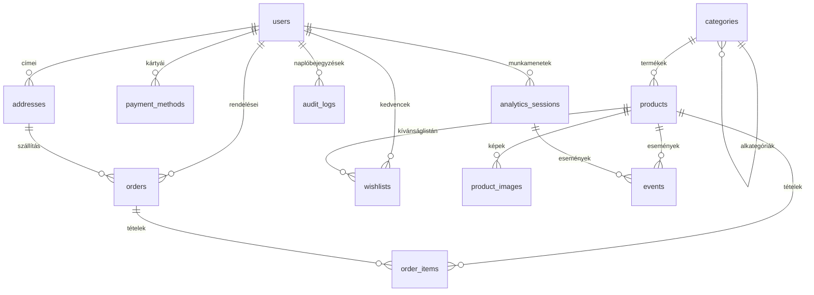

# Adatbázis modell — Buttercup Perfumery

A rendszer teljes adatszerkezete a Laravel migrációk alapján. Az
`adatbazis-modell.png` fájl tartalmazza a kirajzolt diagramot;
ez a Markdown az ahhoz tartozó forrást és a táblák magyarázatát adja.



## Táblák magyarázata

| Tábla | Szerepe |
|-------|---------|
| **users** | Vásárlói fiókok. A `phone` opcionális, az `email_verified_at` jelzi, hogy a felhasználó megerősítette-e a regisztrációkor kapott levelet. |
| **admins** | Admin felhasználók a WPF asztali alkalmazáshoz. Külön tábla, hogy a vásárlói és üzemeltetői hatáskör egyértelműen szétváljon. |
| **categories** | Termékkategóriák, önreferens (`parent_id`) — kétszintű hierarchia (Női parfümök → Eau de Parfum stb.). |
| **products** | Termékek soft-delete-tel. Az `is_active` zászló nélküli termékek nem kerülnek listázásra a webshopban. |
| **product_images** | Termékhez tartozó képek. Az `is_primary` jelöli a borítóképet, amit a listán használunk. |
| **addresses** | Felhasználói szállítási címek. `is_default` szerinti egyetlen kiemelt cím a kiválasztáshoz. |
| **orders** | Rendelések a teljes életciklust lefedő státuszokkal (függő → feldolgozás → szállítás → megérkezett, illetve lemondott / visszatérített). |
| **order_items** | A rendeléshez tartozó tételek. Az egységár a vásárlás pillanatában rögzül, így a termék árváltozása nem hat a régi rendelésekre. |
| **wishlists** | Kedvencek listája. A `(user_id, product_id)` pár egyedi, így ugyanazon termék nem szerepelhet kétszer. |
| **payment_methods** | Mentett bankkártyák. **Csak metaadat:** márka, utolsó 4 jegy, lejárat — sem a teljes szám, sem a CVV nem kerül tárolásra. |
| **coupons** | Kuponkódok százalékos vagy fix összegű kedvezménnyel. |
| **analytics_sessions** | Anonim látogatói munkamenetek a webshopon. |
| **events** | A munkamenetekhez kapcsolódó események (oldalmegtekintés, kattintás, kosárba helyezés stb.). |
| **daily_aggregates** | A nyers eseményekből számolt napi/órás aggregátumok az admin dashboardhoz. |
| **audit_logs** | Az admin felületről indított módosítások naplója. |

## Tervezési döntések

- **Soft delete a termékeken** — a régi rendelési tételek továbbra is hivatkozhatnak a már nem aktív termékre.
- **`SET NULL` az orders táblán** — egy törölt felhasználó vagy cím nem teszi tönkre a rendeléstörténetet.
- **`CASCADE` a wishlist és payment_methods táblákon** — a felhasználó megszűnésével automatikusan eltűnnek a hozzá tartozó személyes adatok.
- **Aggregátum tábla** — a dashboardok valós idejű kérdezgetése helyett óránkénti összesítések, amelyek a `daily_aggregates`-ben élnek.

## A diagram regenerálása

A PNG kép a `.mmd` forrásból a Mermaid CLI segítségével állítható elő:

```bash
npm install -g @mermaid-js/mermaid-cli
npx puppeteer browsers install chrome-headless-shell
mmdc -i adatbazis-modell.mmd -o adatbazis-modell.png -s 3 -b white
```
